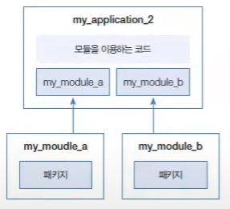

# 10. 라이브러리와 모듈

### 라이브러리
* 프로그램 개발 시 활용할 수 있는 클래스와 인터페이스들을 모아놓은 것을 말한다.
* 일반적으로 JAR(Java ARchive) 압축 파일 (~jar) 형태로 존재한다.
* JAR 파일에는 클래스와 인터페이스의 바이트코드 파일 (~.class)들이 압축되어 있다.
* 특정 클래스와 인터페이스가 여러 응용프로그램을 개발할 때 공통으로 자주 사용된다면 JAR 파일로 압축해서 라이브러리로 관리하는 것이 좋다.

[ 추가 설명 ]
```
* 라이브러리는 소프트웨어 개발에서 재사용 가능한 코드의 모음이다.
* 일반적으로 기능을 추상화하고 특정 작업을 수행하기 위한 API를 제공한다.
* 라이브러리는 특정 프로그래밍 언어로 작성되었으며, 해당 언어의 생태계와 호환되는 함수, 클래스, 모듈 등으로 구성된다.
* 라이브러리는 JAR 파일 형식으로 제공된다.
* Maven 이나 Gradle과 같은 의존성 관리 도구를 통해 프로젝트에 추가될 수 있다.
* 대표적인 자바 라이브러리로는 Apache Commons, Google Guava, Jackson JSON 라이브러리 등이 있다.
```

<center>


라이브러리 프로젝트 생성


코드 작성


프로젝트 구조


6666666


7777


</center>

### 모듈
* Java 9부터 지원하는 모듈은 패키지 관리 기능까지 포함된 라이브러리이다.
* 일반 라이브러리는 내부에 포함된 모든 패키지에 외부 프로그램에서의 접근이 가능하지만, 모듈은 다음과 같이 일부 패키지를 은닉하여 접근할 수 없게끔 할 수 있다.
* 모듈은 자신이 실행할 때 필요로 하는 의존 모듈을 모듈 기술자(module-info.java)에 기술할 수 있기 때문에 모듈 간의 의존 관계를 쉽게 파악할 수 있다는 것이다.
* 아래 그림은 A 모듈은 B 묘듈이 있어야 실행할 수 있고, B 모듈은 C 모듈이 있어야 실행할 수 있는 의존 관계를 보여준다.

[ 추가 설명 ]
```
```

<center>

</center>

* 모듈도 라이브러리이므로 JAR 파일 형태로 배포할 수 있다.
* 응용프로그램을 개발할 때 원하는 기능의 모듈(JAR) 파일을 다운로드해서 이용하면 된다.
* 대규모 응용프로그램은 기능별로 모듈화해서 개발할 수도 있다.
* 모듈별로 개발하고 조립하는 방식을 사용하면 재사용성 및 유지보수에 유리하기 때문이다.

### 응용프로그램 모듈화
* 응용프로그램은 하나의 프로젝트로도 개발이 가능하지만, 이것을 기능별로 서비 프로젝트(모듈)로 쪼갠 다음 조합해서 개발할 수도 있다.

<center>

</center>

* 응용프로그램의 규모가 커질수록 협업과 유지보수 측면에서 서브 모듈로 쪼개서 개발하는 것이 유리하며, 이렇게 개발된 다른 응용프로그램에서도 재사용이 가능하다.
* 위 그림과 동일한 환경을 만들어 모듈 생성 및 사용법을 학습해보자.
