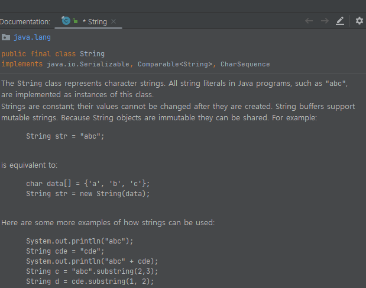

# 11. 라이브러리 활용

### API 도큐먼트
* `자바 표준 모듈`에서 제공하는 라이브러리는 매우 방대한데, 쉽게 찾을 수 있도록 `API 도큐먼트`가 존재한다.
    * 🔗 https://docs.oracle.com/en/java/javase/index.html
        * 각 버전에 따른 API 도큐먼트 페이지가 열린다.
    * 🔗 https://docs.oracle.com/en/java/javase/17/docs/api/index.html (17 버전 기준으로 확인하는 API 도큐먼트)
    * 이클립스에는 String 입력 후 F1 눌렀을 때 Help 뷰가 나타나면 java.lang.String 링크를 클릭하면 해당 도큐먼트로 이동한다고 한다.
    * IntelliJ 에서는 F1 눌렀을 때 IntelliJ 툴에 대한 설명 페이지로 가는 것 같고, String 입력 후 커서를 가져다 대니까 툴 자체에서 도큐먼트 내용을 볼 수 있었다.
    

        
    

* `라이브러리`는 클래스와 인터페이스의 집합이고, `API 도큐먼트`는 이를 사용하기 위한 방법을 말한다.
